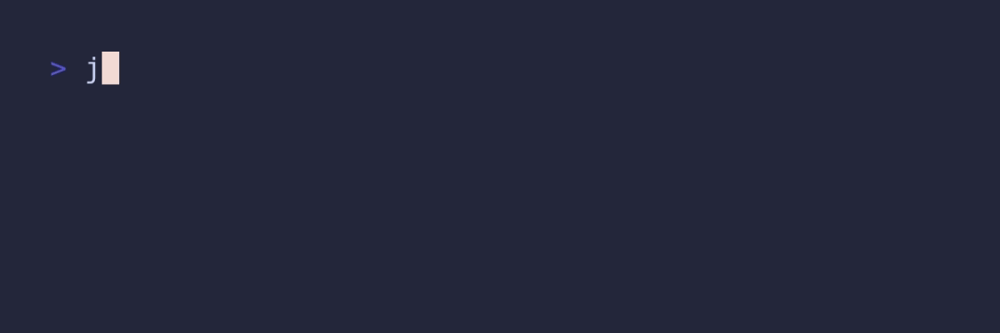
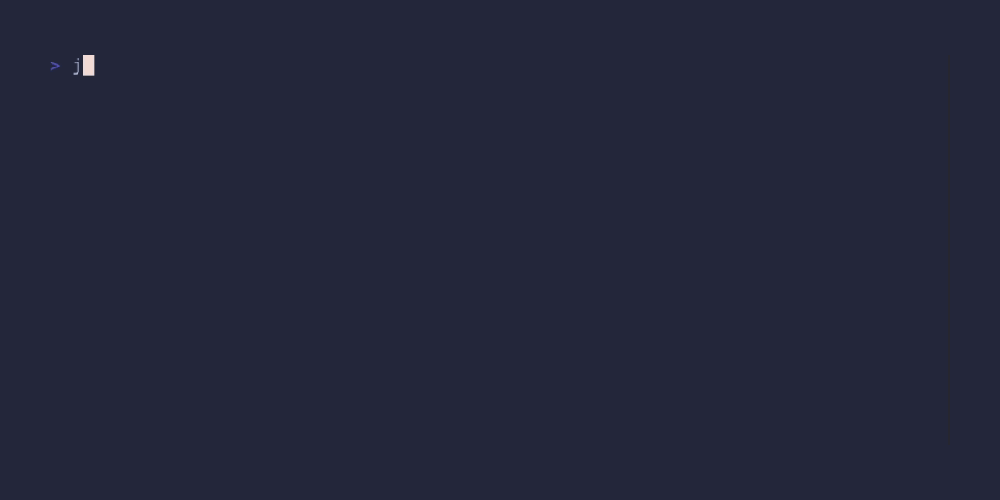
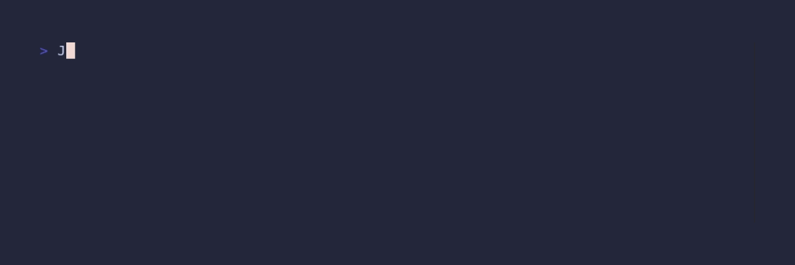

<h1 align="center">Journalscript</h1>
<p align="center">A handy cli tool to write journals</p>

<div align="center">

[](https://opensource.org/licenses/MIT)
[](https://github.com/al3jandr0/journalscript/actions/workflows/ci.yml)
[](https://github.com/al3jandr0/journalscript/actions/workflows/publish_homebrew_tap.yml)

</div>

## Why journalscript

Journalscript allows you to journal without leaving your terminal. It removes the friction that exists when writing a (digital) journal which is to launch a separate journaling app.

Journalscript is ideal for those who 1) work primarily in the terminal and 2) wish to journal more or already journal routinely.

## Features

- Use within the terminal
- Ready to use out of the box
- Support writing multiple journals
- It is Highly configurable
- Support templates for journal entries

## Getting started

### Installation

#### Linux: debian, debian-based, ubuntu

1. Download the debian pacakge (i.e. `journalscript_0.2.0_all.deb`) from the [release page](https://github.com/al3jandr0/journalscript/releases)
2. Run
   ```shell
   sudo apt install journalscript_*_all.deb
   ```
3. Verify the installation by running
   ```shell
   journal -v
   ```
   It should print the version number. Like this `journalscript 0.2.0`

#### Other Linux distibutions - Install from source

For outher distros download the source or clone the repo.

1. Move journal.sh somewhere in your path such that it gets picked it up and make it executable, and (optionaly) remove the extension `.sh`. For example:
   ```shell
   install -T -m 755 ./journal.sh $HOME/.local/bin/journal
   ```
2. Copy the manual `journalscript.1` to a location that it will be found by the `man` command. For example:
   ```shell
   cp journalscript.1 /usr/share/man/man1/journalscript.1
   ```
3. If you are running bash shell, copy the autocomplete script to an appropiate locaition. For example:
   ```shell
   cp src/autocomplete.sh /usr/share/bash-completion/completions/journal
   ```
   Or
   ```shell
   cp src/autocomplete.sh .local/share/bash-completion/completions/journal
   ```

#### MacOS - Homebrew

You will need to make sure you have Homebrew installed on your system. The instructions to do that can be found [here](https://brew.sh/)

##### Option 1. Install the formula

1. Download the formula `journalscript.rb` from the [release page](https://github.com/al3jandr0/journalscript/releases)
2. Then run
   ```shell
   brew install journalscript.rb
   ```
3. Verify the installation by running
   ```shell
   journal -v
   ```
   It should print the version number. Like this `journalscript 0.2.0`
4. If you are running bash shell, follow the steops to [enable completion for Homebrew](https://docs.brew.sh/Shell-Completion). Then copy the autocomplete script to an appropiate locaition. For example:
   ```shell
   cp src/autocomplete.sh "${HOMEBREW_PREFIX}/etc/bash_completion.d/journal"
   ```

##### Option 2. Install from [my tap](https://github.com/al3jandr0/homebrew-tap)

1. Install tap
   ```shell
   brew tap al3jandr0/homebrew-tap
   ```
2. Then install the formula
   ```shell
   brew install journalscript
   ```
3. Verify the installation by running
   ```shell
   journal -v
   ```
   It should print the version number. Like this `journalscript 0.2.0`

#### MacOS - from source

Follow the steps to [install from sournce](#other-linux-distibutions---install-from-source)

### Using Journalscript

The command `journal` creates an entry to your "life" journal. The journal is stored in the default location. See [the configure section](#configure) for information on how to costumize


Example of writing to a different journal


Journalscript creates an entry for the current date, if there is none. Otherwise, it opens the existing entry.

For more information about journalscript commands, run `journal --help` or read the manual `man journalscript`

## Configure

Journalscript loks for the configuration file `journalscript.env` in these location in order

1. `$HOME/.config/journalscript/journalscript.env`
2. `$HOME/.journalscript/journalscript.env`

The command `configure show` aliased `configure` displays the configuration values.


The command `configure init` assit you setting up a new configuration


In addition to customizing the configuration file `journalscript.env`, you can use variables in your environment to override the configuration of journalscript


You can combine this feature with tool such as [direnv](https://direnv.net/) to have directory-level specific journalscript configurations.
In the exaple below uses direnv to store journals in the current directory isntead of the configured directory in `journalscript.env`

### Customizing the editor

Journalscript tries to use the editor the `EDITOR` variable set in your environment. If it is absent, then it defaults to `vim`. However you can configure journalscript to use any editor of choice with the `JOURNALSCRIPT_EDITOR`. For example edit `journalscript.env` and replace the default `JOURNALSCRIPT_EDITOR="vim"` with `JOURNALSCRIPT_EDITOR="emacs"`, `JOURNALSCRIPT_EDITOR="nvim"`, `JOURNALSCRIPT_EDITOR="code"`, etc.

The `JOURNALSCRIPT_EDITOR` settign supports flgas. For example: `JOURNALSCRIPT_EDITOR="code -n $JOURNALSCRIPT_JOURNAL_DIRECTORY"` This command opens the directory that hosts all entires for the journal in a new window instead of opening today's entry only.

By default journalscript creates/open a entry of the current date for a journal (creates new if no entry for the today, otherwise opens existing)
I you wish to add some logic to the opening of a file, for example, openening both today's entry and the previous entry, you could do so by writing a _Open Hook_

_Open Hooks_ are scripts that journalscript executes, if they are enabled, instead of using invoking `JOURNALSCRIPT_EDITOR directly`.

<!---
For example,
* TODO: Show open last and recent hook" This script tells vim to open both todays journal entry and the previous entry in the jourl direcotry
* TODO: ADD GIF where to store the how. And demonstrate what happens
--->

### Backing up journals

Journalscript stores journals in the local file system (techinically your editor of choice does the saving). However it allows you to integrate with the backup mecahnisms of yout choosing. And it does so via hooks:

- _Sync_. Executes before any changes are done to the journal. It makes your local journal to be up tp date with the backup version. A la `git pull`
- _Backup_. Executes after quiting the editor. It sumits (backups) the updates to the journals. Either edits of exiting entry or a new entry. a la `git push`

Many cloud storage services (like DropBox, Google Drive, or OneDrive) do not need the kind of interaction that _Sync_ of _Backup_ allows for. For those kind of systems, simply saving the journal files to designated directories is sufficient, and they take care of synchronizationa and cloud storage automatically. But other systems like git require more interaction. That's wehre sync and backup come in handy.

<!---
For example -  Setting up a github repository to store your journals
- Todo: README: add instructions to create a new repo in the journals directory
- Todo: Delete templates
- Todo: decide whether to continue to suport open hook.  Seems redundant with EDITOR variable
- Todo: simplify default behavior of backup and sync
  - Todo: embed git backup and sync scripts
- todo: Add Gif to demonstrate workflow
--->

### Templates

Documentation comming soon!
